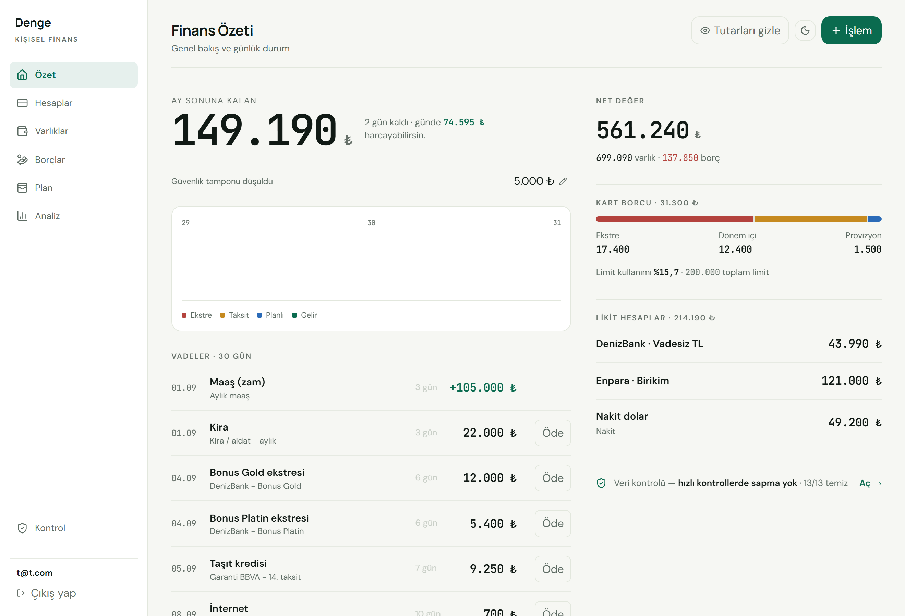
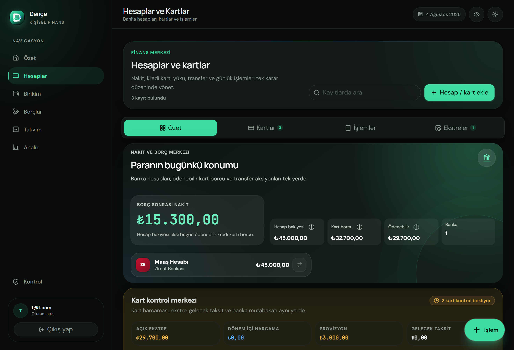
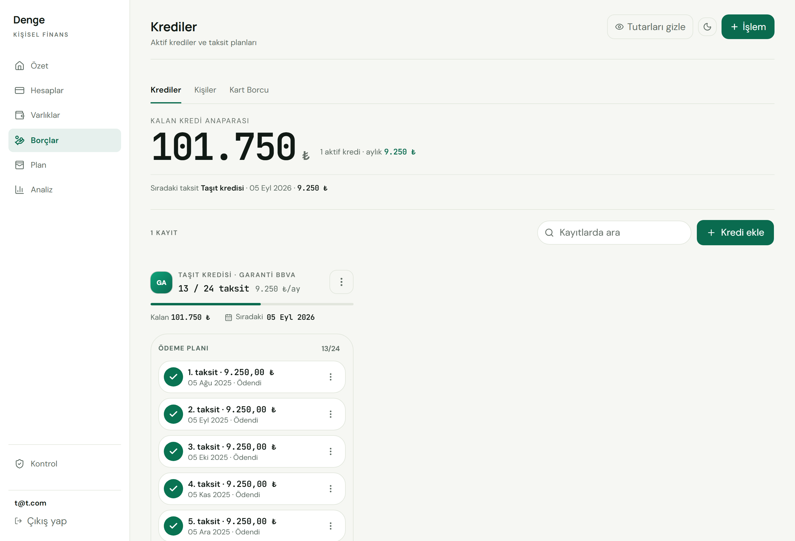
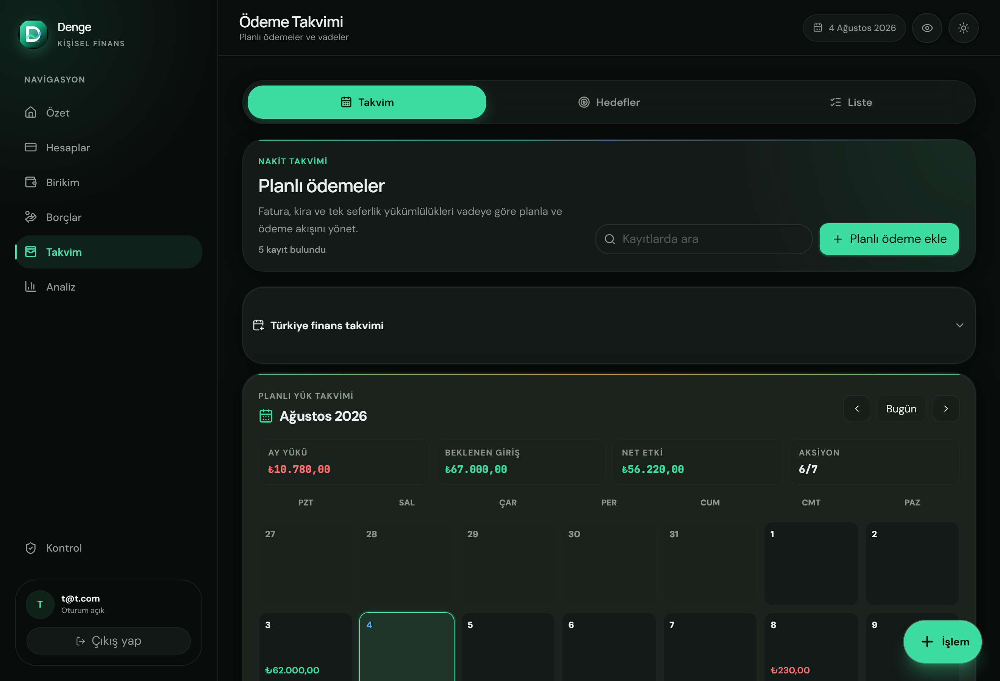
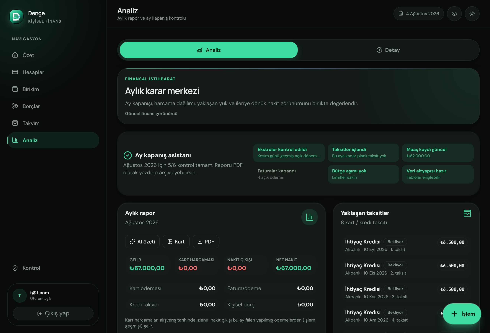
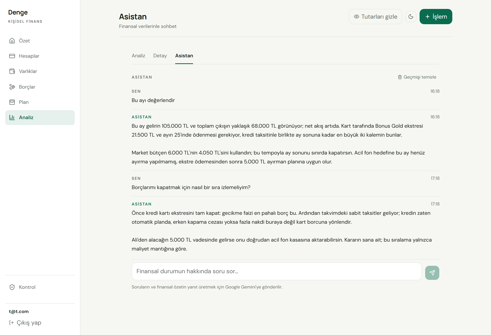
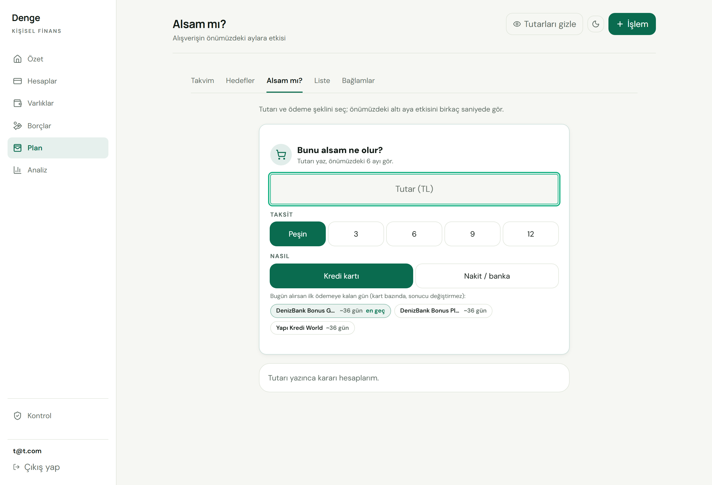

# Denge

**Türkçe** · [English](README.en.md)

**Aylık finansal yükünü, vade kaçmadan görünür kılan kişisel finans uygulaması.**

Denge; nakit, kart, kredi, borç ve planlı ödemeleri tek yerde toplayan Türkçe bir
kişisel finans PWA'sıdır. Amaç basit bir "gelir–gider listesi" tutmak değil,
**bu ay ve önümüzdeki aylarda cebinden ne çıkacağını önceden göstermek** —
ekstre kesilmeden, taksit sırası gelmeden, ödeme günü geçmeden.

`React · TypeScript · Supabase · PWA` — tek kullanıcılık, TL, Türkçe.



## Ne işe yarar?

Kişisel finansta asıl zorluk tek tek harcamalar değil, **birbirine binen
yükümlülükleri zamanında görebilmektir**: kredi kartı ekstresi, kart taksitleri,
kredi taksitleri, kişilere olan borçlar ve tekrar eden ödemeler aynı ayda üst
üste gelir. Denge bunların hepsini tek modelde toplar ve şu soruya cevap verir:

> _"Bu ay ve sonraki aylarda dengede miyim; nereye, ne zaman, ne kadar ödemem gerekiyor?"_

## Kim için?

Denge; **birden fazla banka hesabı, kredi kartı ve taksit** yürüten, ay içinde
ekstre kesimi, taksit sırası ve tekrar eden ödemeler üst üste bindiğinde nakit
dengesini önceden görmek isteyen kişiler içindir. Kısacası _"bu ay ve sonraki
aylarda cebimden ne çıkacak?"_ sorusuna net cevap arayan tek kişilik bir
kullanımı hedefler (TL, Türkçe arayüz).

**Kim için değil:** çok kullanıcılı şirket muhasebesi, ekip/rol yönetimi ya da
çok para birimli yatırım-portföy takibi için tasarlanmadı.

## Özellikler

- **Hesaplar & varlıklar** — Banka kartları, nakit ve yatırım varlıkları, maaş
  geçmişi ve altın takibi. Bakiyeler olay tabanlı (event-sourced) tutulur.
- **Kredi kartı yönetimi** — Harcama, provizyon, ekstre kesimi, taksitli alışveriş
  ve dönem içi ödemeler. Borç; güncel dönem / ekstre / provizyon kovalarına ayrılır.
- **Krediler & kişisel borçlar** — Kredi taksit planları ve kişilere olan
  borç/alacak takibi; taksit takvimiyle birlikte.
- **Planlama & ödeme takvimi** — Yaklaşan ödemeler, aylık nakit akışı projeksiyonu,
  bütçe uyarıları, birikim hedefleri ve taksit takvimi özetleri.
- **Analiz & net değer** — Net değer, servet ve nakit akışı trendleri; işlem geçmişi.
- **AI Asistan** — Kendi finansal verilerinle Türkçe sohbet (`/analiz/asistan`).
  Sorular, uygulamadaki güncel verilerden üretilen kompakt bir özetle birlikte
  Google Gemini'ye gönderilir; geçmiş cihazlar arası kalıcıdır.
- **Karar araçları** — "Alsam mı?" (alışverişin gelecek aylara etkisi), alışveriş
  listesi (30 gün bekleme kuralı + "ne zaman alabilirim"), gider bağlamları
  (evcil hayvan / etkinlik / proje bütçesi).
- **Araçlar & TCO** — Araç başına gider, yakıt ölçümü, hatırlatıcılar ve toplam
  sahip olma maliyeti karnesi.
- **Veri sağlığı & yedek** — Tutarsızlıkları tespit eden ve güvenli düzeltme
  akışları sunan denetim yüzeyi (deterministik, sahiplik ve tür kontrollü
  onarımlar); tek dosya JSON yedek alma / geri yükleme, bildirim tercihleri.
- **PWA** — Ana ekrana eklenebilir, çevrimdışı kabuk, ekle-git kısayolları
  (harcama ekle, planlı ödemeler, analiz), açık/koyu tema, Web Push bildirimleri.

## Durum

- **Stabil (çekirdek):** hesaplar & varlıklar, kredi kartı borcu / ekstre / taksit,
  krediler, kişisel borç-alacak, ödeme takvimi, analiz & net değer, veri sağlığı,
  Web Push bildirimleri (tercih + sessiz saat).
- **Gelişmekte:** SMS'ten provizyon/hareket okuma ve banka ekstresi import'u
  (DenizBank, YapıKredi) tarayıcıda çalışır; tüm-ekstre satır-toplamı doğrulaması
  gerçek ekstrelerde kalibre edilmiş iki bağımsız checksum ile yapılır
  (bkz. `docs/BACKLOG.md`). AI asistan yeni eklendi (Gemini ücretsiz katman).

## Görsel dil: Şerit (Nocturne)

Arayüz, 2026-08 yeniden tasarımıyla gelen **Şerit** görsel dilini kullanır:
gölge ve kutu yığını yerine çizgiyle ayrılan satırlar, ekran başına tek
kahraman rakam, mono + tabular finansal rakamlar; kart yalnız hak eden blokta.
Renk kimliği **Nocturne**: sıcak porselen açık tema, koyu obsidyen koyu tema,
jade vurgu — iki tema da birinci sınıftır. Kurallar:
[`docs/UI_ARCHITECTURE.md`](docs/UI_ARCHITECTURE.md).

## Ekran görüntüleri

> Aşağıdaki görseller yerel geliştirme ortamında **temsili demo veriyle** alınmıştır.

| Hesaplar & kartlar | Krediler & taksitler |
| --- | --- |
|  |  |
| **Ödeme takvimi** | **Analiz & ay kapanışı** |
|  |  |
| **AI Asistan** | **Alsam mı?** |
|  |  |

## Gizlilik & güvenlik

> - Veri **senin kendi Supabase projende** durur; üçüncü bir sunucuya gitmez.
> - Her tabloda satır seviyesi güvenlik (RLS): her satır `user_id = auth.uid()`
>   koşuluyla sınırlıdır.
> - İstemciye yalnızca **anon key** gider; **service role** anahtarı client'a
>   hiçbir zaman konmaz.
> - Frontend filtrelemesine güvenilmez — yetki veritabanında zorlanır.

## Para modeli (güven temeli)

Finans uygulamasında en kritik nokta paranın kesinliğidir. Denge parayı
veritabanında `numeric`, ledger tablolarında ise **işaretli integer kuruş** olarak
tutar; JS tarafındaki tüm yuvarlama/karşılaştırma tek bir çekirdekten
(`src/utils/money.ts`) geçer. Kart borcu, banka bakiyesi, kredi özeti ve kart borç
kırılımı gibi büyük para rakamları ya olaylardan türetilir ya da yazma anında
veritabanı trigger'ıyla korunur — böylece tutarsızlık matematiksel olarak
imkânsız hale gelir. Düzeltmeler geçmişi değiştirmez, **ters kayıt** olarak
eklenir (append-only).

## Mimari

Katmanlar arası sınırlar ESLint ile zorlanır; UI doğrudan Supabase'i göremez:

```
domain   → src/utils/*              Saf hesap/iş kuralı. Yoğun test edilir.
data     → src/data/repositories/*  Tek Supabase teması. Result<T> döndürür.
app      → src/app/*                TanStack Query use-case hook'ları.
ui       → src/pages, components    "Aptal" sunum katmanı.
services → src/services/*           RPC sarmalayıcıları.
lib      → src/lib/*                supabase client, hata kaydı, harici istemciler.
```

**Teknoloji:** React 19 · TypeScript · Vite 7 · Tailwind CSS v4 · TanStack Query ·
React Router v8 · Supabase (Postgres + Auth + Edge Functions) · Google Gemini
(fiş/ekstre okuma + AI asistan, yalnız edge'de) · Vercel (+ Analytics) · PWA.

Uzak hata izleme servisi yoktur (Sentry 2026-08-19'da kaldırıldı): çökme ve
hatalar `AppErrorBoundary` + kendi `client_errors` tablosuyla, RLS altında
uygulama içinde izlenir.

## Kurulum

```bash
npm install

npm run dev            # Üretim Supabase'ine bağlanır (.env.local gerekir)
npm run dev:local      # Yerel Supabase (docker) + Vite — üretime dokunmaz
npm run dev:local:stop # Yerel Supabase docker'ını kapatır
npm run db:seed:local  # Yerel DB'yi sıfırlar + demo veri yükler
```

1. Bir Supabase projesi oluştur (ya da yerel geliştirme için `npm run dev:local`).
2. `supabase/migrations/*` migration'larını CLI ile uygula.
3. `.env.example` dosyasını `.env.local` olarak kopyalayıp değerleri doldur:
   - `VITE_SUPABASE_URL`
   - `VITE_SUPABASE_ANON_KEY`

Yerel girişte demo kullanıcı: `t@t.com / password123` (önce `npm run db:seed:local`;
yalnız yerel docker'da geçerlidir).

Bir değişikliği "bitti" saymadan önce (CI kalite kapısının birebir yerel aynası —
lint + coverage'lı test + bağımlılık denetimi + build + bundle bütçesi + edge tip
kontrolü):

```bash
npm run verify
```

Uçtan uca duman testi için `npm run test:e2e` (Playwright) ayrıca koşulabilir.

## Deploy

`main` dalına push = üretim deploy (GitHub Actions → Vercel). Frontend tek artifact
olarak build edilip staged yüklenir, DB değiştiyse şifreli yedek alınıp migration
uygulanır, canlıya alım sonrası `/login` smoke testi başarısız olursa otomatik
rollback yapılır. Ayrıntı: [`docs/PIPELINE.md`](docs/PIPELINE.md).

## Katkı & AI ajanları

Bu depo AI ajanlarıyla (Claude Code, Codex) çalışacak şekilde belgelenmiştir. Bir
oturuma başlarken önce [`docs/AI_CONTEXT_INDEX.md`](docs/AI_CONTEXT_INDEX.md) —
görev bazlı en kısa okuma rotasını ve konu→dosya tablosunu verir. Kanonik kurallar
[`CLAUDE.md`](CLAUDE.md)'de, domain + tablo + route haritası
[`docs/PROJECT_CONTEXT.md`](docs/PROJECT_CONTEXT.md)'de tutulur.

## Lisans

[MIT](LICENSE) © Enes Garip
